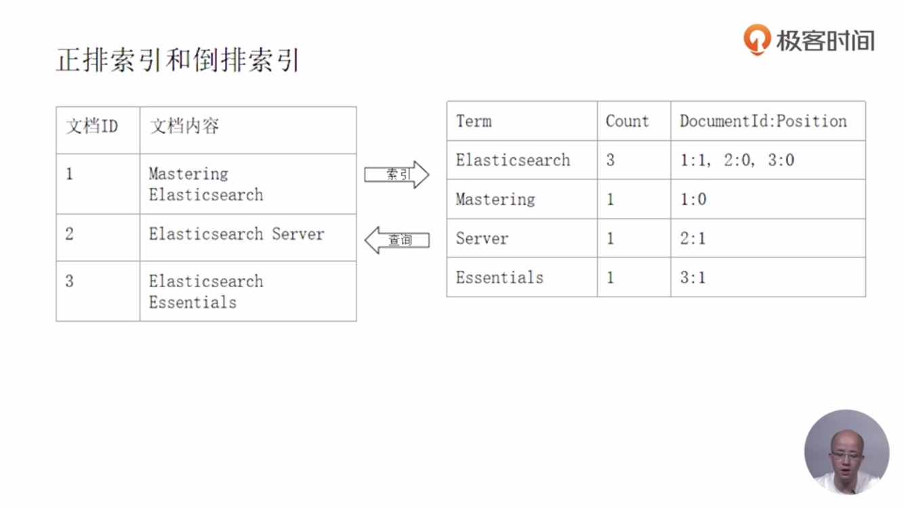
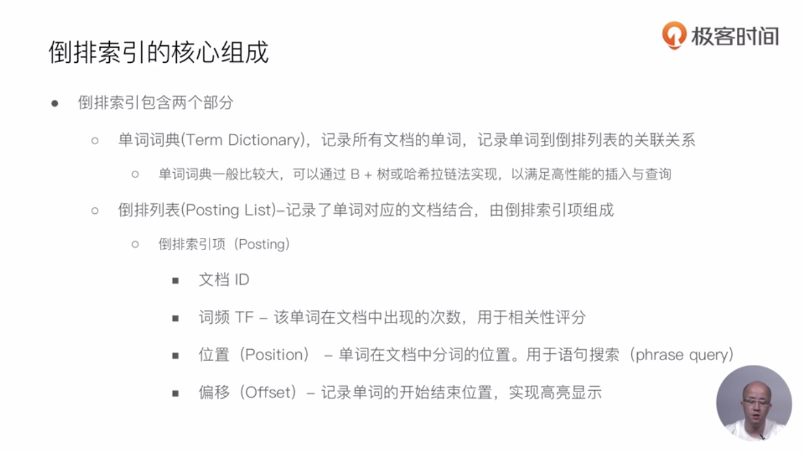
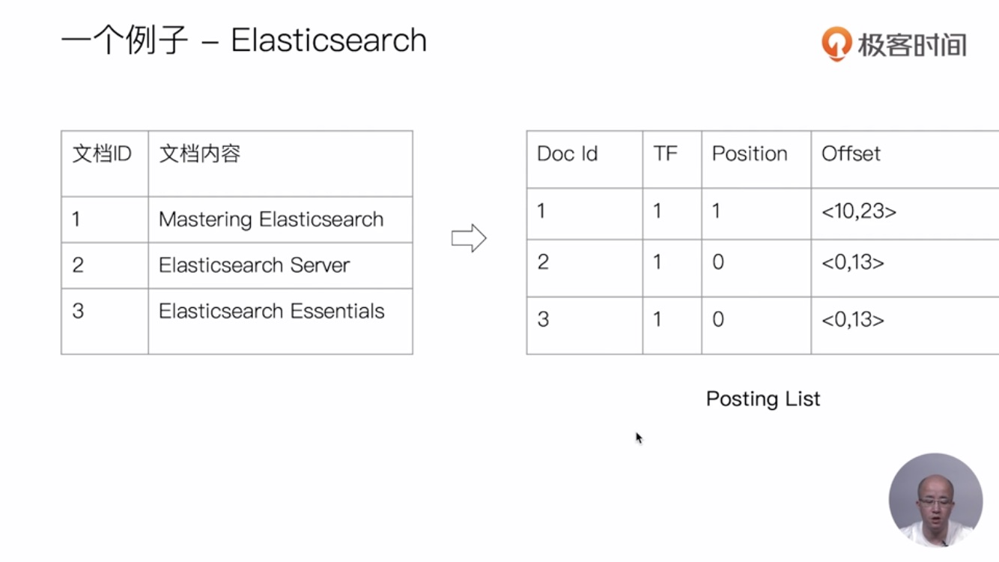
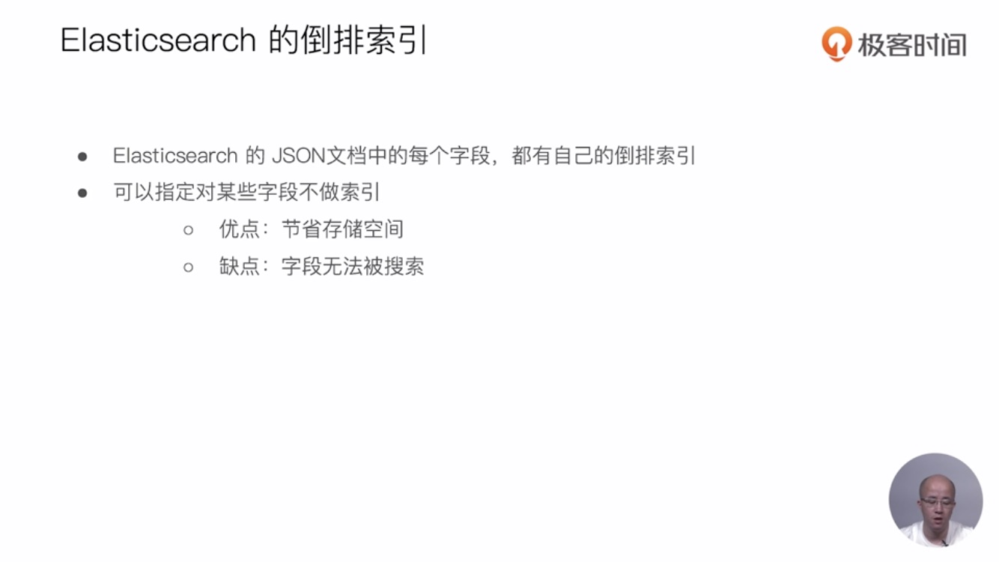

# 倒排索引入门






```tex
上面的一个Elasticsearch例子中，tf用于统计词频，方便打分，
position用于记录term单词位置，方便短语距离查询时用，比如i love you 短语查询i you 允许一个slop，此时position便会发挥作用
offset用于记录字符起始截止偏移，便于高亮
```

##课程Demo
```
POST _analyze
{
  "analyzer": "standard",
  "text": "Mastering Elasticsearch"
}

POST _analyze
{
  "analyzer": "standard",
  "text": "Elasticsearch Server"
}

POST _analyze
{
  "analyzer": "standard",
  "text": "Elasticsearch Essentials"
}

```
## 相关阅读
- https://zh.wikipedia.org/wiki/%E5%80%92%E6%8E%92%E7%B4%A2%E5%BC%95
- https://www.elastic.co/guide/cn/elasticsearch/guide/current/inverted-index.html
